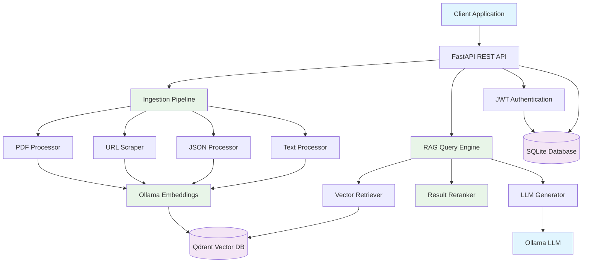
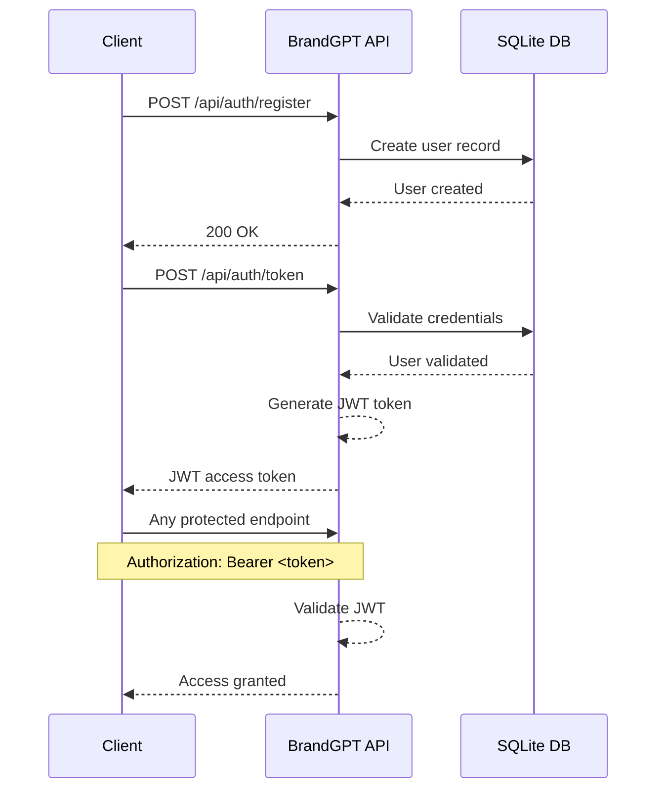
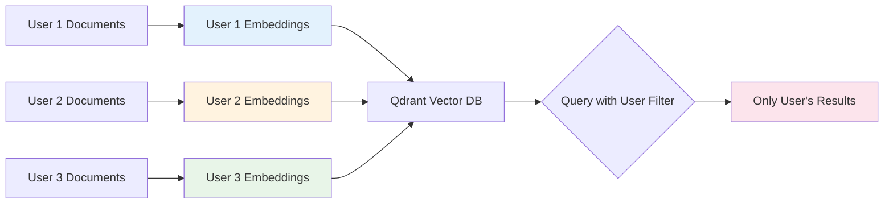
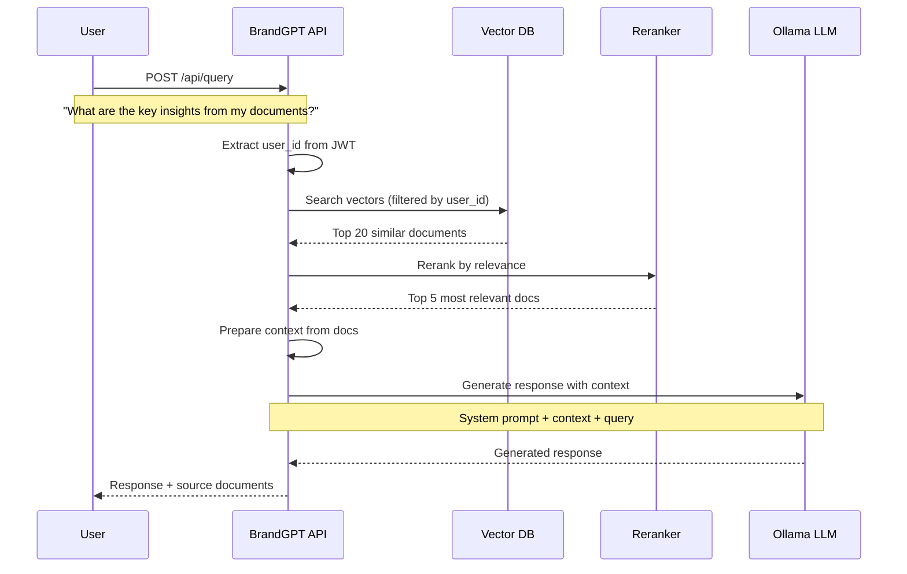

# BrandGPT: Intelligent RAG Application

> A complete Retrieval-Augmented Generation (RAG) application with multi-format document ingestion, user-scoped content management, reusable AI personas, and production-ready Docker deployment.

[](https://python.org)
[](https://fastapi.tiangolo.com)
[](https://docker.com)
[](LICENSE)

## 🚀 Quick Start

### Prerequisites
- **Ollama** (required): Install and run with required models
- **Docker & Docker Compose** (for containerized deployment)
- **Python 3.11+** (for local development)

### 1. Setup Ollama (Host System)
```bash
# Install Ollama
curl -fsSL https://ollama.ai/install.sh | sh

# Pull required models
ollama pull hf.co/Qwen/Qwen3-Embedding-8B-GGUF
ollama pull mistral-small:24b

# Verify Ollama is running
curl http://localhost:11434/api/tags
```

### 2. Deploy with Docker
```bash
git clone https://github.com/AIspezialisten/brandgpt_simple.git
cd brandgpt_simple

# Automated deployment
./deploy.sh

# Or manual deployment
docker-compose up -d
```

### 3. Access Your RAG Application
- **API**: http://localhost:9700
- **Interactive Docs**: http://localhost:9700/docs
- **Health Check**: http://localhost:9700/health

---

## 📖 Table of Contents

- [🎯 Key Features](#-key-features)
- [🏗️ System Architecture](#️-system-architecture)
- [🔐 Authentication System](#-authentication-system)
- [📚 Document Ingestion](#-document-ingestion)
- [🤖 AI Personas & Prompts](#-ai-personas--prompts)
- [🔍 RAG Query System](#-rag-query-system)
- [🌐 Complete API Reference](#-complete-api-reference)
- [💡 Usage Examples](#-usage-examples)
- [🐳 Docker Deployment](#-docker-deployment)
- [🧪 Testing](#-testing)

---

## 🎯 Key Features

### 📄 **Multi-Format Document Ingestion**
- **PDF Documents**: Extract text, tables, and metadata
- **Web URLs**: Crawl and scrape with configurable depth
- **JSON Data**: Smart processing with natural language conversion
- **Text Files**: Direct text processing with automatic chunking

### 👤 **User-Scoped Content Management**
- **Private Content**: Each user's documents are isolated and secure
- **Cross-Session Access**: Access your content from any session
- **Persistent Storage**: Documents remain available across app restarts

### 🎭 **Reusable AI Personas**
- **Prompt Library**: Store and reuse custom system prompts
- **Multiple Personas**: Switch between different AI personalities
- **Consistent Behavior**: Same persona maintains consistent responses

### 🔄 **Advanced RAG Pipeline**
- **Intelligent Retrieval**: Vector similarity search with user filtering
- **Result Reranking**: Improve relevance with cross-encoder models
- **Context Generation**: Smart context preparation for LLM
- **Response Generation**: High-quality responses with source attribution

---

## 🏗️ System Architecture



### Technology Stack
- **🌐 API Framework**: FastAPI with automatic OpenAPI docs
- **🤖 LLM Integration**: Ollama (Mistral-Small-24B for generation)
- **🔤 Embeddings**: Qwen3-Embedding-8B-GGUF via Ollama
- **🗃️ Vector Database**: Qdrant for high-performance similarity search
- **💾 Metadata Storage**: SQLite for users, sessions, and documents
- **🔄 Workflow Orchestration**: LangGraph for RAG pipeline
- **🐳 Deployment**: Docker with host networking for optimal performance

---

## 🔐 Authentication System

### How Authentication Works

The BrandGPT API uses **JWT (JSON Web Tokens)** for stateless authentication:

1. **User Registration**: Create account with username, email, password
2. **Login**: Exchange credentials for JWT access token
3. **Token Usage**: Include token in `Authorization` header for protected endpoints
4. **User Isolation**: All content is automatically scoped to the authenticated user

### Authentication Workflow



## 🌐 Complete API Reference

### 🔐 Authentication Endpoints

#### Register User
Creates a new user account in the system.

**Endpoint:** `POST /api/auth/register`

**Request Body:**
```json
{
  "username": "john_doe",
  "email": "john@example.com", 
  "password": "secure_password123"
}
```

**Response:** `200 OK`
```json
{
  "id": 1,
  "username": "john_doe",
  "email": "john@example.com",
  "is_active": true,
  "created_at": "2024-01-15T10:30:00"
}
```

**Python Example:**
```python
import requests

response = requests.post(
    "http://localhost:9700/api/auth/register",
    json={
        "username": "john_doe",
        "email": "john@example.com",
        "password": "secure_password123"
    }
)
user = response.json()
print(f"User created: {user['username']} (ID: {user['id']})")
```

**JavaScript Example:**
```javascript
const response = await fetch('http://localhost:9700/api/auth/register', {
    method: 'POST',
    headers: {
        'Content-Type': 'application/json',
    },
    body: JSON.stringify({
        username: 'john_doe',
        email: 'john@example.com',
        password: 'secure_password123'
    })
});

const user = await response.json();
console.log(`User created: ${user.username} (ID: ${user.id})`);
```

**Error Responses:**
- `400 Bad Request`: Username or email already exists
- `422 Unprocessable Entity`: Invalid input format

#### Login / Get Access Token
Authenticates user and returns JWT access token for API access.

**Endpoint:** `POST /api/auth/token`

**Request Body:** (Form-encoded)
```
username=john_doe&password=secure_password123
```

**Response:** `200 OK`
```json
{
  "access_token": "eyJhbGciOiJIUzI1NiIsInR5cCI6IkpXVCJ9...",
  "token_type": "bearer"
}
```

**Python Example:**
```python
import requests

response = requests.post(
    "http://localhost:9700/api/auth/token",
    data={
        "username": "john_doe",
        "password": "secure_password123"
    },
    headers={"Content-Type": "application/x-www-form-urlencoded"}
)

token_data = response.json()
access_token = token_data["access_token"]

# Use token for subsequent requests
headers = {"Authorization": f"Bearer {access_token}"}
```

**JavaScript Example:**
```javascript
const response = await fetch('http://localhost:9700/api/auth/token', {
    method: 'POST',
    headers: {
        'Content-Type': 'application/x-www-form-urlencoded',
    },
    body: new URLSearchParams({
        username: 'john_doe',
        password: 'secure_password123'
    })
});

const tokenData = await response.json();
const accessToken = tokenData.access_token;

// Use token for subsequent requests
const headers = {
    'Authorization': `Bearer ${accessToken}`,
    'Content-Type': 'application/json'
};
```

**Error Responses:**
- `401 Unauthorized`: Invalid username or password

---

### 📋 Session Management

Sessions are containers for your conversations and document access. Each session can have its own AI persona (system prompt) while accessing all your ingested documents.

#### Create Session
Creates a new conversation session with optional AI persona.

**Endpoint:** `POST /api/sessions`

**Authentication:** Required (`Authorization: Bearer <token>`)

**Request Body Options:**

**Option 1: Using Stored Prompt**
```json
{
  "prompt_id": 123
}
```

**Option 2: Using Inline System Prompt**
```json
{
  "system_prompt": "You are a helpful business analyst. Focus on ROI and strategic insights."
}
```

**Option 3: Default Session (No Custom Prompt)**
```json
{}
```

**Response:** `200 OK`
```json
{
  "id": "abc123-def456-ghi789",
  "user_id": 1,
  "prompt_id": 123,
  "system_prompt": "You are a helpful business analyst...",
  "created_at": "2024-01-15T10:30:00"
}
```

**Python Example:**
```python
# Create session with stored prompt
session_response = requests.post(
    "http://localhost:9700/api/sessions",
    json={"prompt_id": 123},
    headers=headers
)

session_id = session_response.json()["id"]
print(f"Session created: {session_id}")

# Create session with inline prompt
session_response = requests.post(
    "http://localhost:9700/api/sessions",
    json={
        "system_prompt": "You are a technical expert. Focus on implementation details and best practices."
    },
    headers=headers
)
```

**JavaScript Example:**
```javascript
// Create session with stored prompt
const sessionResponse = await fetch('http://localhost:9700/api/sessions', {
    method: 'POST',
    headers: headers,
    body: JSON.stringify({
        prompt_id: 123
    })
});

const session = await sessionResponse.json();
console.log(`Session created: ${session.id}`);
```

#### List Sessions
Retrieves all sessions for the authenticated user.

**Endpoint:** `GET /api/sessions`

**Authentication:** Required

**Response:** `200 OK`
```json
[
  {
    "id": "abc123-def456-ghi789",
    "user_id": 1,
    "prompt_id": 123,
    "system_prompt": null,
    "created_at": "2024-01-15T10:30:00"
  },
  {
    "id": "xyz789-uvw456-rst123",
    "user_id": 1,
    "prompt_id": null,
    "system_prompt": "You are a creative writer...",
    "created_at": "2024-01-15T11:45:00"
  }
]
```

---

### 🎭 AI Persona & Prompt Management

The prompt system allows you to create reusable AI personas with consistent behavior across sessions.

#### Create Prompt
Stores a reusable system prompt (AI persona) for use in sessions.

**Endpoint:** `POST /api/prompts`

**Authentication:** Required

**Request Body:**
```json
{
  "name": "Business Consultant",
  "description": "AI persona focused on business strategy and ROI analysis",
  "content": "You are an experienced business consultant with 15+ years in strategy consulting. Focus on business impact, ROI, market positioning, and strategic recommendations. Use business terminology and provide actionable insights. Always consider competitive advantages and market opportunities."
}
```

**Response:** `200 OK`
```json
{
  "id": 123,
  "name": "Business Consultant",
  "description": "AI persona focused on business strategy and ROI analysis",
  "content": "You are an experienced business consultant...",
  "created_by": 1,
  "created_at": "2024-01-15T10:30:00"
}
```

**Python Example:**
```python
# Create reusable AI personas
personas = [
    {
        "name": "Technical Expert",
        "description": "Senior software engineer focused on best practices",
        "content": "You are a senior software engineer with expertise in system architecture. Focus on technical implementation, performance optimization, scalability, and coding best practices. Provide detailed technical explanations with code examples when relevant."
    },
    {
        "name": "Creative Writer",
        "description": "Storyteller who makes content engaging and accessible",
        "content": "You are a creative writer and storyteller. Transform technical information into engaging narratives with human interest angles, analogies, and vivid descriptions. Make complex topics accessible through storytelling techniques."
    }
]

created_prompts = []
for persona in personas:
    response = requests.post(
        "http://localhost:9700/api/prompts",
        json=persona,
        headers=headers
    )
    created_prompts.append(response.json())
    print(f"Created persona: {persona['name']}")
```

**JavaScript Example:**
```javascript
const persona = {
    name: "Data Scientist",
    description: "Expert in statistical analysis and machine learning",
    content: "You are a data scientist with expertise in statistical analysis, machine learning, and data visualization. Focus on data patterns, statistical significance, predictive insights, and data-driven recommendations. Use quantitative reasoning and mention relevant metrics."
};

const response = await fetch('http://localhost:9700/api/prompts', {
    method: 'POST',
    headers: headers,
    body: JSON.stringify(persona)
});

const prompt = await response.json();
console.log(`Created persona: ${prompt.name} (ID: ${prompt.id})`);
```

#### List Prompts
Retrieves all stored prompts (AI personas) accessible to the user.

**Endpoint:** `GET /api/prompts`

**Authentication:** Required

**Response:** `200 OK`
```json
[
  {
    "id": 123,
    "name": "Business Consultant",
    "description": "AI persona focused on business strategy and ROI analysis",
    "content": "You are an experienced business consultant...",
    "created_by": 1,
    "created_at": "2024-01-15T10:30:00"
  },
  {
    "id": 124,
    "name": "Technical Expert",
    "description": "Senior software engineer focused on best practices",
    "content": "You are a senior software engineer...",
    "created_by": 1,
    "created_at": "2024-01-15T10:35:00"
  }
]
```

---

## 📚 Document Ingestion

The ingestion system processes multiple document formats and stores them as searchable vector embeddings. **All content is automatically scoped to your user account** - you can only search your own documents.

### How User-Scoped Content Works



**Key Concepts:**
- **Privacy**: Your documents are never visible to other users
- **Persistence**: Documents remain available across all your sessions
- **Searchability**: All your content is searchable from any session
- **Scalability**: Add unlimited documents without performance degradation

### File Upload (PDF, Text, JSON)
Processes and stores uploaded files with automatic format detection.

**Endpoint:** `POST /api/ingest/file/{session_id}`

**Authentication:** Required

**Request:** Multipart form data with file upload

**Python Example:**
```python
# Upload PDF document
session_id = "abc123-def456-ghi789"
with open("business_report.pdf", "rb") as file:
    files = {"file": ("business_report.pdf", file, "application/pdf")}
    response = requests.post(
        f"http://localhost:9700/api/ingest/file/{session_id}",
        files=files,
        headers={"Authorization": f"Bearer {access_token}"}  # Note: no Content-Type for multipart
    )

result = response.json()
print(f"Document ingestion started: {result['document_id']}")

# Upload JSON data
with open("company_data.json", "rb") as file:
    files = {"file": ("company_data.json", file, "application/json")}
    response = requests.post(
        f"http://localhost:9700/api/ingest/file/{session_id}",
        files=files,
        headers={"Authorization": f"Bearer {access_token}"}
    )

# Upload text file  
with open("research_notes.txt", "rb") as file:
    files = {"file": ("research_notes.txt", file, "text/plain")}
    response = requests.post(
        f"http://localhost:9700/api/ingest/file/{session_id}",
        files=files,
        headers={"Authorization": f"Bearer {access_token}"}
    )
```

**JavaScript Example:**
```javascript
// Upload PDF using FormData
const sessionId = 'abc123-def456-ghi789';
const fileInput = document.getElementById('fileInput'); // HTML file input
const file = fileInput.files[0];

const formData = new FormData();
formData.append('file', file);

const response = await fetch(`http://localhost:9700/api/ingest/file/${sessionId}`, {
    method: 'POST',
    headers: {
        'Authorization': `Bearer ${accessToken}`
        // Note: Don't set Content-Type for FormData, browser sets it automatically
    },
    body: formData
});

const result = await response.json();
console.log(`Document ingestion started: ${result.document_id}`);
```

**Response:** `200 OK`
```json
{
  "document_id": 456,
  "status": "processing",
  "message": "File ingestion started"
}
```

**Supported File Types:**
- **PDF**: Extracts text, preserves structure, handles tables
- **Text**: Direct processing with automatic chunking
- **JSON**: Smart conversion to natural language format
- **Auto-detection**: System automatically detects JSON in .txt files

### URL Ingestion
Crawls and processes web content with configurable depth for comprehensive knowledge base creation.

**Endpoint:** `POST /api/ingest/url`

**Authentication:** Required

**Request Body:**
```json
{
  "session_id": "abc123-def456-ghi789",
  "content_type": "url", 
  "url": "https://example.com/article",
  "max_depth": 2
}
```

**Depth Parameter Explanation:**
- `max_depth: 1` - Only scrapes the provided URL (default)
- `max_depth: 2` - Scrapes the URL + all pages it links to (1 level deep)
- `max_depth: 3` - Scrapes the URL + linked pages + their linked pages (2 levels deep)
- Maximum allowed depth: 10 (configurable via `MAX_SCRAPE_DEPTH` environment variable)

**Response:** `200 OK`
```json
{
  "document_id": 789,
  "status": "processing", 
  "message": "URL ingestion started"
}
```

**Python Example:**
```python
# Crawl single page
url_data = {
    "session_id": session_id,
    "content_type": "url",
    "url": "https://en.wikipedia.org/wiki/Artificial_intelligence",
    "max_depth": 1  # Just the main page
}

response = requests.post(
    "http://localhost:9700/api/ingest/url",
    json=url_data,
    headers=headers
)

# Crawl website with depth - comprehensive knowledge base creation
deep_crawl = {
    "session_id": session_id,
    "content_type": "url", 
    "url": "https://company.com/docs/",
    "max_depth": 3  # Scrapes: main page + all linked pages + their linked pages
}

response = requests.post(
    "http://localhost:9700/api/ingest/url",
    json=deep_crawl,
    headers=headers
)

# Example: Wikipedia article with related pages
wikipedia_crawl = {
    "session_id": session_id,
    "content_type": "url",
    "url": "https://en.wikipedia.org/wiki/Machine_Learning",
    "max_depth": 2  # Gets main article + all Wikipedia pages it references
}
```

**JavaScript Example:**
```javascript
const urlData = {
    session_id: sessionId,
    content_type: 'url',
    url: 'https://docs.company.com/getting-started',
    max_depth: 2
};

const response = await fetch('http://localhost:9700/api/ingest/url', {
    method: 'POST',
    headers: headers,
    body: JSON.stringify(urlData)
});

const result = await response.json();
console.log(`URL crawling started: ${result.document_id}`);
```

**URL Processing Features:**
- **Configurable Depth Crawling**: Control how many levels of links to follow (1-10 levels)
- **Same-Domain Restriction**: Only follows links within the same domain for security
- **Smart Content Extraction**: Removes navigation, ads, and boilerplate content
- **Multi-Page Processing**: Each discovered page becomes a separate searchable document
- **Rate Limiting**: Implements delays between requests (configurable via `DOWNLOAD_DELAY`)
- **Link Limitation**: Configurable maximum links per page (default: 20) to prevent excessive crawling

### Check Document Status
Monitor the processing status of ingested documents.

**Endpoint:** `GET /api/documents/{session_id}`

**Authentication:** Required

**Response:** `200 OK`
```json
[
  {
    "id": 456,
    "session_id": "abc123-def456-ghi789",
    "filename": "business_report.pdf",
    "content_type": "pdf", 
    "processed": "completed",
    "processed_at": "2024-01-15T10:35:00",
    "error_message": null
  },
  {
    "id": 789,
    "session_id": "abc123-def456-ghi789", 
    "url": "https://example.com/article",
    "content_type": "url",
    "processed": "processing",
    "processed_at": null,
    "error_message": null
  }
]
```

---

## 🔍 RAG Query System

The RAG (Retrieval-Augmented Generation) system searches your documents and generates contextual responses using advanced AI.

### How RAG Works



### Query Documents
Search your documents and get AI-generated responses with source attribution.

**Endpoint:** `POST /api/query`

**Authentication:** Required

**Request Body:**
```json
{
  "query": "What are the main business opportunities mentioned in the reports?",
  "session_id": "abc123-def456-ghi789",
  "use_system_prompt": true
}
```

**Response:** `200 OK`
```json
{
  "response": "Based on the ingested documents, there are three main business opportunities identified:\n\n1. **Digital Transformation**: The reports highlight significant potential in modernizing legacy systems, with an estimated ROI of 300% over 18 months.\n\n2. **Market Expansion**: Analysis shows untapped markets in Southeast Asia, particularly in the fintech sector, representing a $2.5B opportunity.\n\n3. **AI Integration**: Implementation of AI-driven automation could reduce operational costs by 25-30% while improving customer satisfaction scores.",
  "sources": [
    {
      "text": "Digital transformation initiatives show strong ROI potential, with companies reporting average returns of 250-400% within the first two years...",
      "metadata": {
        "filename": "business_report.pdf",
        "page_number": 15,
        "document_id": 456
      }
    },
    {
      "text": "Southeast Asian markets present significant growth opportunities, particularly in financial technology sectors...",
      "metadata": {
        "url": "https://research.com/market-analysis",
        "document_id": 789
      }
    }
  ],
  "error": null
}
```

**Python Example:**
```python
# Query with specific session (uses session's AI persona)
query_data = {
    "query": "Summarize the key technical challenges mentioned in the documentation",
    "session_id": session_id,
    "use_system_prompt": True  # Use the session's AI persona
}

response = requests.post(
    "http://localhost:9700/api/query",
    json=query_data,
    headers=headers
)

result = response.json()
print("AI Response:")
print(result["response"])

print(f"\nBased on {len(result['sources'])} source documents:")
for i, source in enumerate(result["sources"], 1):
    metadata = source["metadata"]
    if "filename" in metadata:
        print(f"{i}. {metadata['filename']} (Page {metadata.get('page_number', '?')})")
    else:
        print(f"{i}. {metadata.get('url', 'Unknown source')}")

# Query without session-specific persona (default behavior)
general_query = {
    "query": "What is the overall sentiment of the content?",
    "use_system_prompt": False  # Use default AI behavior
}

response = requests.post(
    "http://localhost:9700/api/query",
    json=general_query,
    headers=headers
)
```

**JavaScript Example:**
```javascript
// Query with AI persona
const queryData = {
    query: "What are the main risks identified in the analysis?",
    session_id: sessionId,
    use_system_prompt: true
};

const response = await fetch('http://localhost:9700/api/query', {
    method: 'POST',
    headers: headers,
    body: JSON.stringify(queryData)
});

const result = await response.json();

console.log("AI Response:", result.response);
console.log(`\nSources (${result.sources.length}):`);
result.sources.forEach((source, index) => {
    const metadata = source.metadata;
    const sourceInfo = metadata.filename || metadata.url || 'Unknown source';
    console.log(`${index + 1}. ${sourceInfo}`);
});
```

**RAG Pipeline Features:**
- **User-Scoped Search**: Only searches your documents, never other users' content
- **Semantic Search**: Finds relevant content even with different wording
- **Advanced Reranking**: Uses cross-encoder models to improve relevance
- **Source Attribution**: Always shows which documents contributed to the answer
- **Persona Consistency**: Maintains AI persona behavior across queries

---

## 💡 Usage Examples

### Complete Workflow Example

Here's a complete example showing how to use all the main features:

**Python Complete Example:**
```python
import requests
import time

class BrandGPTClient:
    def __init__(self, base_url="http://localhost:9700"):
        self.base_url = base_url
        self.session = requests.Session()
        self.token = None
    
    def register_and_login(self, username, email, password):
        """Register user and get access token"""
        # Register
        user_data = {
            "username": username,
            "email": email,
            "password": password
        }
        
        try:
            response = self.session.post(f"{self.base_url}/api/auth/register", json=user_data)
            if response.status_code == 400:
                print("User already exists, proceeding to login")
        except Exception as e:
            print(f"Registration failed: {e}")
        
        # Login
        login_data = {
            "username": username,
            "password": password
        }
        response = self.session.post(
            f"{self.base_url}/api/auth/token",
            data=login_data,
            headers={"Content-Type": "application/x-www-form-urlencoded"}
        )
        
        token_data = response.json()
        self.token = token_data["access_token"]
        self.session.headers.update({"Authorization": f"Bearer {self.token}"})
        print(f"✅ Logged in as {username}")
    
    def create_ai_persona(self, name, description, content):
        """Create a reusable AI persona"""
        persona_data = {
            "name": name,
            "description": description,
            "content": content
        }
        response = self.session.post(f"{self.base_url}/api/prompts", json=persona_data)
        persona = response.json()
        print(f"✅ Created AI persona: {name} (ID: {persona['id']})")
        return persona["id"]
    
    def create_session_with_persona(self, prompt_id):
        """Create a session with specific AI persona"""
        session_data = {"prompt_id": prompt_id}
        response = self.session.post(f"{self.base_url}/api/sessions", json=session_data)
        session = response.json()
        print(f"✅ Created session: {session['id']}")
        return session["id"]
    
    def upload_document(self, session_id, file_path):
        """Upload and process a document"""
        with open(file_path, 'rb') as file:
            files = {"file": (file_path, file)}
            response = self.session.post(
                f"{self.base_url}/api/ingest/file/{session_id}",
                files=files
            )
        
        result = response.json()
        print(f"✅ Document uploaded: {file_path} (Doc ID: {result['document_id']})")
        return result["document_id"]
    
    def crawl_website(self, session_id, url, max_depth=2):
        """Crawl and ingest website content"""
        url_data = {
            "session_id": session_id,
            "content_type": "url",
            "url": url,
            "max_depth": max_depth
        }
        response = self.session.post(f"{self.base_url}/api/ingest/url", json=url_data)
        result = response.json()
        print(f"✅ Website crawling started: {url} (Doc ID: {result['document_id']})")
        return result["document_id"]
    
    def wait_for_processing(self, session_id, timeout=60):
        """Wait for document processing to complete"""
        print("⏳ Waiting for document processing...")
        start_time = time.time()
        
        while time.time() - start_time < timeout:
            response = self.session.get(f"{self.base_url}/api/documents/{session_id}")
            documents = response.json()
            
            processing_docs = [doc for doc in documents if doc.get("processed") == "processing"]
            if not processing_docs:
                print("✅ All documents processed")
                return True
            
            time.sleep(5)
        
        print("⚠️ Timeout waiting for processing")
        return False
    
    def query_documents(self, query, session_id=None, use_persona=True):
        """Query documents with AI response"""
        query_data = {
            "query": query,
            "use_system_prompt": use_persona
        }
        if session_id:
            query_data["session_id"] = session_id
        
        response = self.session.post(f"{self.base_url}/api/query", json=query_data)
        result = response.json()
        
        print(f"\n🤖 AI Response:")
        print(result["response"])
        print(f"\n📚 Based on {len(result['sources'])} sources:")
        for i, source in enumerate(result["sources"][:3], 1):
            metadata = source["metadata"]
            source_info = metadata.get("filename") or metadata.get("url", "Unknown")
            print(f"  {i}. {source_info}")
        
        return result

# Complete workflow example
def main():
    client = BrandGPTClient()
    
    # 1. Authentication
    client.register_and_login(
        username="demo_user",
        email="demo@example.com", 
        password="secure_password123"
    )
    
    # 2. Create AI personas
    business_persona_id = client.create_ai_persona(
        name="Business Strategist",
        description="Expert in business strategy and market analysis", 
        content="You are a senior business strategist with 15+ years of experience. Focus on strategic insights, market opportunities, competitive analysis, and ROI. Provide actionable business recommendations."
    )
    
    technical_persona_id = client.create_ai_persona(
        name="Technical Architect",
        description="Senior software architect and technical leader",
        content="You are a senior technical architect. Focus on system design, scalability, performance, and technical best practices. Provide detailed technical analysis and implementation recommendations."
    )
    
    # 3. Create sessions with different personas
    business_session = client.create_session_with_persona(business_persona_id)
    technical_session = client.create_session_with_persona(technical_persona_id)
    
    # 4. Upload documents (you would have actual files)
    # client.upload_document(business_session, "business_plan.pdf")
    # client.upload_document(technical_session, "technical_specs.json") 
    
    # 5. Crawl relevant websites
    client.crawl_website(business_session, "https://en.wikipedia.org/wiki/Business_strategy", max_depth=1)
    client.crawl_website(technical_session, "https://en.wikipedia.org/wiki/Software_architecture", max_depth=1)
    
    # 6. Wait for processing
    client.wait_for_processing(business_session)
    client.wait_for_processing(technical_session)
    
    # 7. Query with different personas
    query = "What are the key principles and best practices mentioned in the content?"
    
    print("\n" + "="*60)
    print("BUSINESS STRATEGIST PERSPECTIVE:")
    print("="*60)
    client.query_documents(query, business_session, use_persona=True)
    
    print("\n" + "="*60)
    print("TECHNICAL ARCHITECT PERSPECTIVE:")
    print("="*60)
    client.query_documents(query, technical_session, use_persona=True)

if __name__ == "__main__":
    main()
```

**JavaScript Complete Example:**
```javascript
class BrandGPTClient {
    constructor(baseUrl = 'http://localhost:9700') {
        this.baseUrl = baseUrl;
        this.token = null;
    }
    
    async registerAndLogin(username, email, password) {
        // Register user
        try {
            await fetch(`${this.baseUrl}/api/auth/register`, {
                method: 'POST',
                headers: { 'Content-Type': 'application/json' },
                body: JSON.stringify({ username, email, password })
            });
        } catch (error) {
            console.log('User might already exist, proceeding to login');
        }
        
        // Login and get token
        const response = await fetch(`${this.baseUrl}/api/auth/token`, {
            method: 'POST',
            headers: { 'Content-Type': 'application/x-www-form-urlencoded' },
            body: new URLSearchParams({ username, password })
        });
        
        const tokenData = await response.json();
        this.token = tokenData.access_token;
        console.log(`✅ Logged in as ${username}`);
    }
    
    get headers() {
        return {
            'Authorization': `Bearer ${this.token}`,
            'Content-Type': 'application/json'
        };
    }
    
    async createAIPersona(name, description, content) {
        const response = await fetch(`${this.baseUrl}/api/prompts`, {
            method: 'POST',
            headers: this.headers,
            body: JSON.stringify({ name, description, content })
        });
        
        const persona = await response.json();
        console.log(`✅ Created AI persona: ${name} (ID: ${persona.id})`);
        return persona.id;
    }
    
    async createSessionWithPersona(promptId) {
        const response = await fetch(`${this.baseUrl}/api/sessions`, {
            method: 'POST',
            headers: this.headers,
            body: JSON.stringify({ prompt_id: promptId })
        });
        
        const session = await response.json();
        console.log(`✅ Created session: ${session.id}`);
        return session.id;
    }
    
    async crawlWebsite(sessionId, url, maxDepth = 2) {
        const response = await fetch(`${this.baseUrl}/api/ingest/url`, {
            method: 'POST',
            headers: this.headers,
            body: JSON.stringify({
                session_id: sessionId,
                content_type: 'url',
                url: url,
                max_depth: maxDepth
            })
        });
        
        const result = await response.json();
        console.log(`✅ Website crawling started: ${url} (Doc ID: ${result.document_id})`);
        return result.document_id;
    }
    
    async waitForProcessing(sessionId, timeout = 60000) {
        console.log('⏳ Waiting for document processing...');
        const startTime = Date.now();
        
        while (Date.now() - startTime < timeout) {
            const response = await fetch(`${this.baseUrl}/api/documents/${sessionId}`, {
                headers: this.headers
            });
            const documents = await response.json();
            
            const processingDocs = documents.filter(doc => doc.processed === 'processing');
            if (processingDocs.length === 0) {
                console.log('✅ All documents processed');
                return true;
            }
            
            await new Promise(resolve => setTimeout(resolve, 5000));
        }
        
        console.log('⚠️ Timeout waiting for processing');
        return false;
    }
    
    async queryDocuments(query, sessionId = null, usePersona = true) {
        const queryData = {
            query: query,
            use_system_prompt: usePersona
        };
        if (sessionId) queryData.session_id = sessionId;
        
        const response = await fetch(`${this.baseUrl}/api/query`, {
            method: 'POST',
            headers: this.headers,
            body: JSON.stringify(queryData)
        });
        
        const result = await response.json();
        
        console.log('\n🤖 AI Response:');
        console.log(result.response);
        console.log(`\n📚 Based on ${result.sources.length} sources:`);
        result.sources.slice(0, 3).forEach((source, i) => {
            const metadata = source.metadata;
            const sourceInfo = metadata.filename || metadata.url || 'Unknown';
            console.log(`  ${i + 1}. ${sourceInfo}`);
        });
        
        return result;
    }
}

// Usage example
async function main() {
    const client = new BrandGPTClient();
    
    // Authentication
    await client.registerAndLogin('demo_user', 'demo@example.com', 'secure_password123');
    
    // Create AI personas
    const businessPersonaId = await client.createAIPersona(
        'Business Analyst',
        'Expert in business analysis and strategy',
        'You are a business analyst. Focus on business impact, market insights, and strategic recommendations.'
    );
    
    // Create session and ingest content
    const sessionId = await client.createSessionWithPersona(businessPersonaId);
    await client.crawlWebsite(sessionId, 'https://en.wikipedia.org/wiki/Business_analysis');
    await client.waitForProcessing(sessionId);
    
    // Query with AI persona
    await client.queryDocuments(
        'What are the main methodologies mentioned for business analysis?',
        sessionId,
        true
    );
}

main().catch(console.error);
```

---

## 🐳 Docker Deployment

### Production Deployment

The application is designed for easy deployment using Docker with optimal networking configuration.

**Architecture:**
- **Host Networking**: Both app and Qdrant use host networking for optimal performance
- **Ollama Integration**: Seamless connection to Ollama running on host
- **Persistent Storage**: SQLite and Qdrant data preserved across restarts

### Quick Deployment

```bash
# Clone repository
git clone https://github.com/AIspezialisten/brandgpt_simple.git
cd brandgpt_simple

# Automated deployment
./deploy.sh
```

### Manual Deployment

```bash
# Ensure Ollama is running with models
ollama pull hf.co/Qwen/Qwen3-Embedding-8B-GGUF
ollama pull mistral-small:24b

# Create data directory
mkdir -p data

# Deploy services
docker-compose up -d

# Check status
docker-compose ps
curl http://localhost:9700/health
```

### Docker Compose Configuration

```yaml
services:
  app:
    build: .
    network_mode: host
    environment:
      - QDRANT_URL=http://localhost:6333
      - OLLAMA_BASE_URL=http://localhost:11434
      - API_HOST=0.0.0.0
      - API_PORT=9700
    volumes:
      - ./data:/app/data
    restart: unless-stopped

  qdrant:
    image: qdrant/qdrant:latest
    network_mode: host
    volumes:
      - qdrant_data:/qdrant/storage
    environment:
      - QDRANT__SERVICE__HTTP_PORT=6333
    restart: unless-stopped

volumes:
  qdrant_data:
```

### Service URLs
- **BrandGPT API**: http://localhost:9700
- **API Documentation**: http://localhost:9700/docs
- **Qdrant Dashboard**: http://localhost:6333/dashboard
- **Health Check**: http://localhost:9700/health

### Management Commands

```bash
# View logs
docker-compose logs -f

# Restart services
docker-compose restart

# Stop services
docker-compose down

# Update deployment
git pull
docker-compose down
docker-compose up -d --build

# Backup data
cp data/brandgpt.db data/backup-$(date +%Y%m%d).db
```

---

## 🧪 Testing

### Test Categories

The application includes comprehensive test coverage:

**Unit Tests:**
- Authentication and JWT handling
- Document processing (PDF, JSON, text, URL)
- Vector operations and similarity search
- RAG pipeline components

**Integration Tests:**
- End-to-end document ingestion workflows
- Complete RAG query pipelines
- Multi-user content isolation
- Session and persona management

**Performance Tests:**
- Load testing with multiple concurrent users
- Large document processing
- Query response times
- Vector search performance

### Running Tests

```bash
# Install test dependencies
uv pip install -e .

# Run all tests
uv run pytest tests/ -v

# Run specific test categories
python run_tests.py --suite auth          # Authentication tests
python run_tests.py --suite ingestion     # Document processing
python run_tests.py --suite query         # RAG pipeline tests
python run_tests.py --suite integration   # End-to-end tests
python run_tests.py --suite performance   # Performance tests

# Quick test run (skip slow tests)
python run_tests.py --suite all --fast

# Run with coverage report
python run_tests.py --suite all --coverage
```

### Test Configuration

Tests require running services:
```bash
# Start required services for testing
docker-compose up -d

# Set test environment variables
export TEST_API_URL=http://localhost:9700
export TEST_SKIP_SLOW=true  # Skip performance tests
```

---

## 📋 Environment Configuration

### Required Environment Variables

```bash
# Ollama Configuration
OLLAMA_BASE_URL=http://localhost:11434
OLLAMA_MODEL=hf.co/Qwen/Qwen3-Embedding-8B-GGUF
OLLAMA_LLM_MODEL=mistral-small:24b

# Qdrant Configuration
QDRANT_URL=http://localhost:6333
QDRANT_COLLECTION_NAME=brandgpt
QDRANT_VECTOR_SIZE=4096

# API Configuration
API_HOST=0.0.0.0
API_PORT=9700

# Security
SECRET_KEY=your-secret-key-change-in-production
ACCESS_TOKEN_EXPIRE_MINUTES=30

# Processing Configuration
CHUNK_SIZE=1000
CHUNK_OVERLAP=200
MAX_FILE_SIZE_MB=100
RERANKER_TOP_K=5
RERANKER_CANDIDATES=20
```

### Development vs Production

**Development (.env):**
```bash
API_RELOAD=true
DEBUG=true
LOG_LEVEL=DEBUG
```

**Production (.env):**
```bash
API_RELOAD=false
DEBUG=false
LOG_LEVEL=INFO
SECRET_KEY=strong-random-secret-key
```

---

## 🔧 Troubleshooting

### Common Issues

**1. Cannot connect to Ollama**
```bash
# Check Ollama status
curl http://localhost:11434/api/tags

# Check required models
ollama list | grep -E "(qwen3|mistral-small)"

# Pull missing models
ollama pull hf.co/Qwen/Qwen3-Embedding-8B-GGUF
ollama pull mistral-small:24b
```

**2. Qdrant connection failed**
```bash
# Check Qdrant status
curl http://localhost:6333/collections

# Check Docker containers
docker-compose ps qdrant
docker-compose logs qdrant
```

**3. Document ingestion fails**
```bash
# Check processing status
curl -H "Authorization: Bearer $TOKEN" \
  http://localhost:9700/api/documents/$SESSION_ID

# Check application logs
docker-compose logs app | tail -50
```

**4. No search results returned**
```bash
# Verify documents are indexed
curl http://localhost:6333/collections/brandgpt

# Check user isolation
# Make sure you're querying with the same user who uploaded documents
```

### Debug Mode

Enable debug logging for detailed troubleshooting:

```bash
# Set debug environment
export DEBUG=true
export LOG_LEVEL=DEBUG

# Restart application
docker-compose restart app

# View detailed logs
docker-compose logs -f app
```

---

## 🤝 Contributing

We welcome contributions! Please see our contributing guidelines:

1. **Fork the repository**
2. **Create feature branch**: `git checkout -b feature/amazing-feature`
3. **Run tests**: `python run_tests.py --suite all`
4. **Commit changes**: `git commit -m 'Add amazing feature'`
5. **Push to branch**: `git push origin feature/amazing-feature`
6. **Open Pull Request**

### Development Setup

```bash
# Clone your fork
git clone https://github.com/yourusername/brandgpt_simple.git
cd brandgpt_simple

# Install development dependencies
uv pip install -e ".[dev]"

# Setup pre-commit hooks
pre-commit install

# Run tests
python run_tests.py --suite all
```

---

## 📄 License

This project is licensed under the MIT License - see the [LICENSE](LICENSE) file for details.

---

## 🙏 Acknowledgments

- **LangChain & LangGraph**: Advanced RAG pipeline orchestration
- **Ollama**: Local LLM and embedding model serving
- **Qdrant**: High-performance vector database
- **FastAPI**: Modern, fast web framework for APIs
- **The Open Source Community**: For the amazing tools and libraries

---

## 📞 Support

For support and questions:

- **Documentation**: Check this README and `/docs` endpoint
- **Issues**: Open an issue on GitHub
- **Discussions**: Use GitHub Discussions for questions

---

*Built with ❤️ using modern AI and vector search technologies*